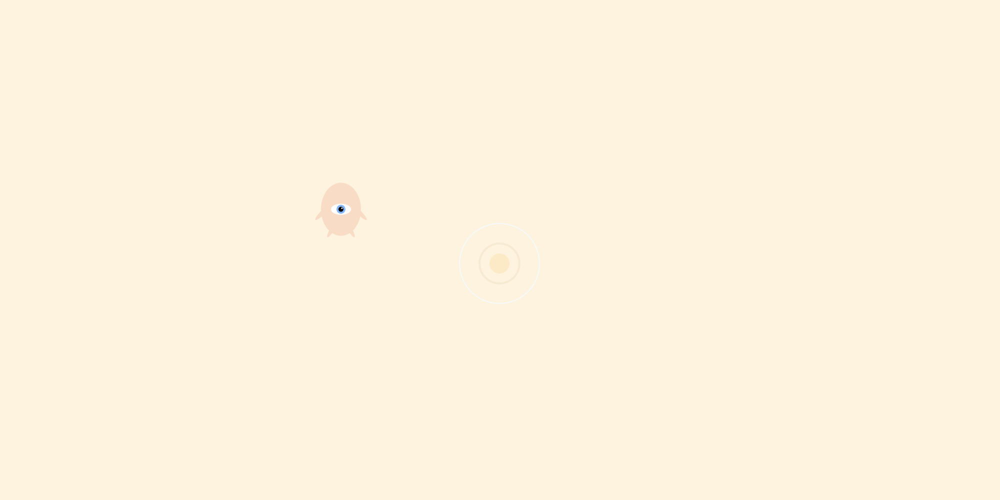

</img>

## [camilo ortiz](https://camilodoa.ml)

*he/him*

I'm currently working on [tracking ICE raids](https://ai-melts-ice.ml) with deep
learning. If you'd be interested in helping grow this project, please reach out.

I'm also making on a set of reinforcement learning agents that live in the browser.
Their bodies are animated with Paper.js, and their RL algorithms
([q-learning](https://camilodoa.ml/ra), [shallow deep learning](https://camilodoa.ml/dra)) are implemented from scratch.
I've been trying to create a LIF spiking neural network agent and would love some tips if you have any!

<!-- ---

</img>

### [Ra](https://camilodoa.ml/ra)
*Q-learning agent*

---

</img>

### [Dra](https://camilodoa.dra)
*Deep reinforcement learning agent* -->
